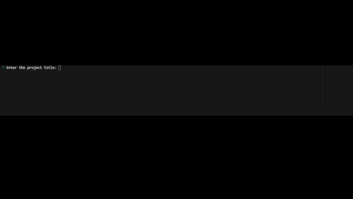

# ReadMe-Print Generator

## Description

This is a professional README file generator that provides a README file for the user's project. The generator inities a file that automatically inputs the description, table of contents, installation, usage, contribution, tests, license costs, and questions that is provided in the prompts by the user.

## Acceptance Criteria

GIVEN a command-line application that accepts user input
WHEN I am prompted for information about my application repository
THEN a high-quality, professional README.md is generated with the title of my project and sections entitled Description, Table of Contents, Installation, Usage, License, Contributing, Tests, and Questions
WHEN I enter my project title
THEN this is displayed as the title of the README
WHEN I enter a description, installation instructions, usage information, contribution guidelines, and test instructions
THEN this information is added to the sections of the README entitled Description, Installation, Usage, Contributing, and Tests
WHEN I choose a license for my application from a list of options
THEN a badge for that license is added near the top of the README and a notice is added to the section of the README entitled License that explains which license the application is covered under
WHEN I enter my GitHub username
THEN this is added to the section of the README entitled Questions, with a link to my GitHub profile
WHEN I enter my email address
THEN this is added to the section of the README entitled Questions, with instructions on how to reach me with additional questions
WHEN I click on the links in the Table of Contents
THEN I am taken to the corresponding section of the README

## Usage

- Follow the prompts to enter the necessary information for your project, such as the title, description, installation instructions, usage, etc.
- Once you have provided all the required information, the README generator will generate a professional README file for your project. The generated README file will be saved as README.md in the project directory.
- You can then open the generated README.md file and make any additional changes or edits as needed.

## Installation

## Contributing

Contributions to the ReadMe-Print Generator are welcome! If you find any issues or have suggestions for improvements, please submit a pull request. Make sure to follow the repository's code style and guidelines.